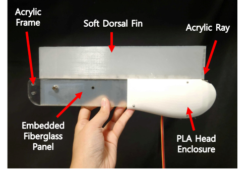

# Overview
- Proposing an efficient fish robot design where, leveraging the physical properties of the dorsal fin material, only the front part of the fin is motor-driven to initiate wave propagation
- Design a linear quadratic regulator (LQR) and feedforward controller to manage the movement of the fish's fin

# Set up
Install the packages in requirements.txt
`$ pip install -r requirements.txt`

# Robot Assembly

1. Laser cutting acrylic fin ray, fish body-Acrylic Frame, Fiberglass Panel
2. Build silicone fin using mold embedded with FR4 and fin ray 

3. 3D printing PLA Head Closure 
'''
cad\Fish\Body1_L.SLDPRT
cad\Fish\Body1_R.SLDPRT
'''
4. Assemble Savox motor with left Head Closure, Fin with acrylic body frame, 

# Data

# Control System Modeling
- Aim to control the wave motion of the undulatory dorsal fin of robotic fish
- Employed a frequency-response-based control system modeling method
1. Using Fish's fin top view video data, run src\dataGenProc\multiObjectTracking.py to calculate the fin's each position in time
2. Run src\dataGenProc\GenerateBodedata.py to create bode plot with the processed video data
3. Run src\dataGenProc\EstimateTF.m in MATLAB to estimate Transfer Function from Bode Plot, and generate discrete time state space model
4. Design LQR gain, Kalman filter gain by running src\dataGenProc\ControllerDesign.m in MATLAB

# Testing Controller in Robotic Fish
1. Run src\controlSystem\realTimeTracking.py to track the tail point of the fin and send it to Arduino
2. Run src\controlSystem\discretecontroller\discretecontroller.ino in Aruino IDE and output motor sin wave frequency